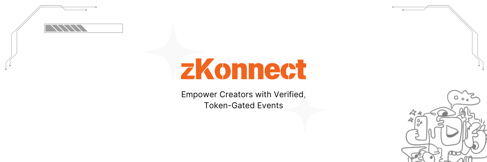

# Welcome to zKonnect 🎉

### Empowering Creators with Verified, Token-Gated Events

**zKonnect** is the ultimate platform designed to simplify and secure online event management for creators and fans. Say goodbye to multiple, inefficient tools and unethical ticket bypassing. With **zKonnect**, creators can focus on their craft while we handle the tech.

---

## 🌟 **Key Features**

- 🚀 **Seamless Creator Onboarding**  
  Effortless verification using zk proofs to authenticate follower count.

- 🎟️ **Efficient Ticket Creation**  
  Generate event-specific tickets with ease, which fans can purchase directly from social media posts through Blinks.

- 🎫 **NFT Ticketing (cNFTs)**  
  Tickets are minted as **SolBound cNFTs** to prevent unauthorized transfer and guarantee authenticity.

- 🔒 **Token-Gated Event Hosting**  
  Only verified ticket holders can access the event, preventing unauthorized entry.

- 🖥️ **Integrated Event Meet Hosting**  
  Direct event link access for ticket holders.  
  **dRTC** powered by **Huddle01 SDK** ensures a smooth, secure, and seamless event experience.

- 🔗 **Mass Distribution via Unique Blink**  
  Share event links on social platforms with a single **Blink**, ensuring broad visibility and engagement.

---

## 💡 **Why Choose zKonnect?**

- 💼 **Economic Solution**: Combines multiple event management requirements into one platform.
- 🏆 **Creator Empowerment**: Gives creators complete control over their event lifecycle, from ticketing to hosting.
- 🔐 **Unmatched Security**: Token-gating and SolBound NFTs ensure ticket authenticity and prevent unauthorized access.
- 📈 **Scalable for Creators**: From small gatherings to large-scale events, zKonnect adapts to any audience size.

---

## 🚀 **How It Works**:

1. 👤 **Creator Onboarding**:  
   Verify your follower count through zk proofs.
2. 📅 **Event Creation**:  
   Once verified, easily set up your event. Generate a **Blink** for mass distribution.
3. 🪙 **Ticket Minting**:  
   Fans buy their tickets as **SolBound cNFTs**, ensuring they are unique and non-transferable.
4. 🔗 **Event Access**:  
   Ticket holders click the event link and are redirected to the secure event meet, powered by **Huddle01 SDK**.

---

### 💻 **Tech Stack**:

- 🔐 **zk Proofs** for follower verification by Reclaim Protocol.
- 🎫 **cNFTs (SolBound)** for non-transferable tickets using Metaplex.
- 🖥️ **Huddle01 SDK** for dRTC event hosting leveraging Huddle01.

---

For more information, just reach out our founder team 💌

- **Manish**: CEO, Full-stack dev. 
- **Debopom**: Marketing and operations. 
- **Prerna**: UI/UX designer. 
- **Bartick**: Backend dev.

---

© 2024 **zKonnect** - Empowering Creators, Enhancing Events
